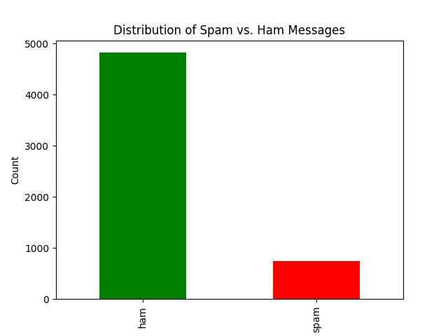
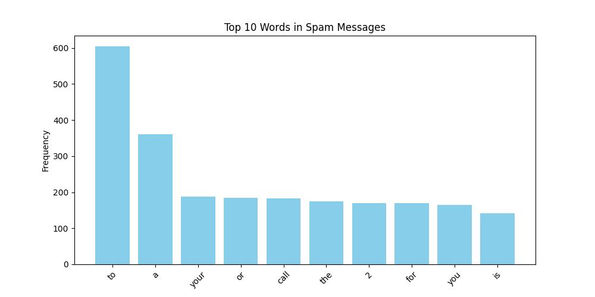
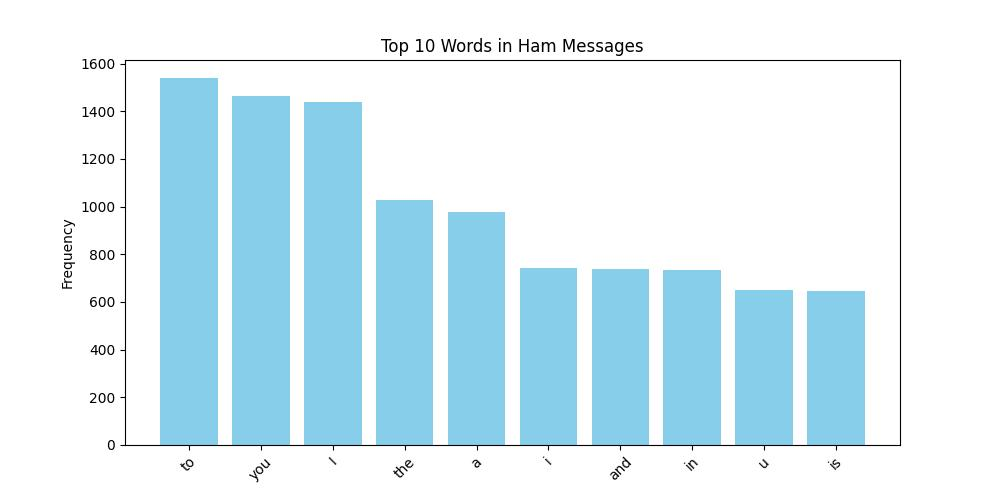

# Spam Detection using Machine Learning

## Table of Contents
- [Introduction](#introduction)
- [Dataset](#dataset)
- [Data Exploration and Insights](#data-exploration-and-insights)
- [Data Preprocessing](#data-preprocessing)
- [Modeling](#modeling)
- [Model Performance Insights](#model-performance-insights)
- [Conclusion](#conclusion)
- [Future Work](#future-work)

## Introduction
This project focuses on building a machine learning model to classify messages as 'spam' or 'ham' (not spam). We leverage a labeled dataset and employ various preprocessing techniques and models to achieve our goal.

## Dataset
The dataset comprises two primary columns:
- `Category`: Denotes if the message is 'spam' or 'ham'.
- `Message`: The actual content of the message.

## Data Exploration and Insights

### Distribution of Spam vs. Ham Messages

### Most Frequent Words in Spam and Ham Messages

From the visualizations, we discerned:
- Spam messages frequently contain words related to offers, prizes, and urgency (e.g., "free", "txt", "mobile").
- In contrast, ham messages predominantly feature casual and everyday words.

## Data Preprocessing
- Transformed the 'Category' column into binary labels: 'spam' is 1, and 'ham' is 0.
- Partitioned the dataset into training and testing subsets.
- Converted the text data into a matrix of token counts using `CountVectorizer`.

## Modeling

### Multinomial Naive Bayes
- Employed the Multinomial Naive Bayes model.
- Achieved an accuracy of 99.19%.
- Error metrics: 
  - MAE: 0.0081
  - MSE: 0.0081
  - RMSE: 0.0898

### Logistic Regression
- Utilized the Logistic Regression model with `max_iter=1000`.
- Attained an accuracy of 98.65%.
- Error metrics: 
  - MAE: 0.0135
  - MSE: 0.0135
  - RMSE: 0.1160 

## Model Performance Insights
The distinct patterns in word frequencies suggest that word choice in a message is a potent indicator of its classification. Here's why the Multinomial Naive Bayes might have a slight edge over Logistic Regression for this dataset:

- **Feature Independence with High Dimensionality:** MNB's assumption of feature independence can be advantageous with high-dimensional data like text.
  
- **Handling of Rare Words:** MNB's probabilistic nature can capture the significance of rare but indicative words.
  
- **Simplicity and Dataset Characteristics:** MNB's simplicity might be more aligned with the dataset's straightforward relationships between words and classes.
  
- **Probabilistic Interpretation:** MNB models the probability of each class based on word occurrences, making it effective for this dataset.

## Conclusion
Both models showcased high accuracy in distinguishing between spam and ham messages. The choice between them hinges on specific needs, such as interpretability, deployment considerations, and computational efficiency.

## Future Work
- Experimentation with alternative text representation techniques like TF-IDF or word embeddings.
- Exploration of more intricate models like SVM, Random Forest, or Gradient Boosting Machines.
- Potential deployment of the model as a web application or API for real-time spam detection.
- Designing a system for model retraining with fresh data to adapt to evolving spam trends.
