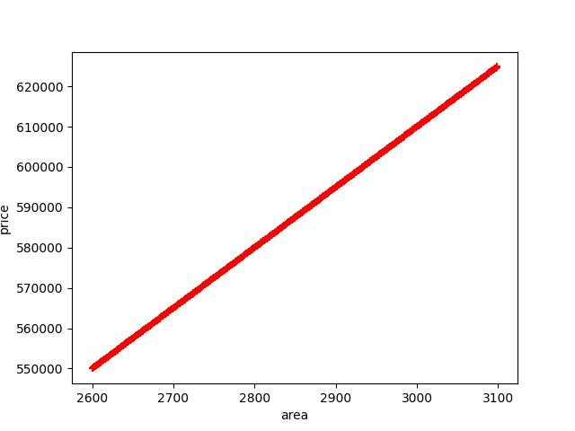

# Machine Learning Project: Linear Regression for Home Price Prediction

This repository contains a machine learning project that demonstrates linear regression for predicting home prices based on square feet area. The project uses Python and the scikit-learn library for building and evaluating a linear regression model.

## Problem Statement

The goal of this project is to build a machine learning model that can predict home prices in Monroe Township, New Jersey, based on the square feet area of the homes.

## Data

The dataset used for this project is `housing.csv`, which represents the relationship between the area of homes and their corresponding prices. The dataset is visualized in the scatter plot below:

## Linear Regression Model

The project involves training a linear regression model to predict home prices based on the area. Here's a brief overview of the steps:

1. Data Preprocessing: The dataset is loaded, duplicates are removed, missing values are filled, and the data is prepared for training.

2. Data Visualization: The scatter plot of area vs. price is plotted to visualize the data distribution.

3. Model Training: The dataset is split into training and testing sets. A linear regression model is trained using the training data.

4. Model Evaluation: The model's performance is evaluated using the R-squared score, mean absolute error (MAE), mean squared error (MSE), and root mean squared error (RMSE).

5. Prediction: The model is used to predict home prices for specific areas.

## Results

The linear regression model's performance on the test data:

- MAE: 0.0
- MSE: 0.0
- RMSE: 0.0

## Usage

To run this project locally, follow these steps:

Run the notebook:
Open and run the `house_price_prediction.ipynb` notebook using Jupyter or any compatible environment or find the code in `house_price_prediction.py`.

## Predictions

You can use the trained model to predict home prices for different areas. For example:

- Predicting price for an area of 3300 sq. ft: $655000$
- Predicting price for an area of 5000 sq. ft: $910000$

## Author

[Azim]

Feel free to explore the notebook for detailed code and explanations.

